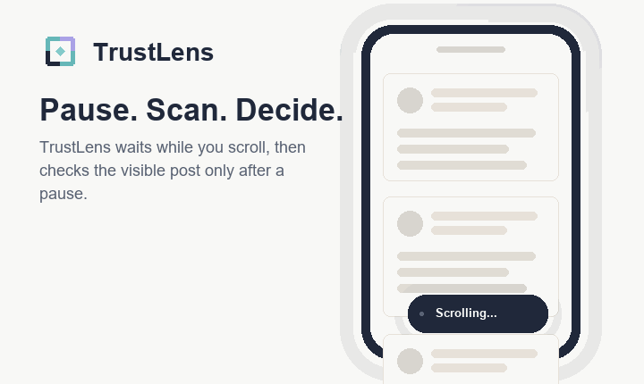
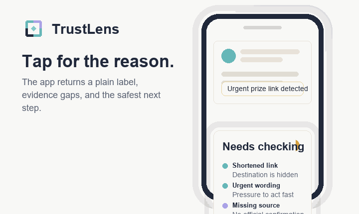

# TrustLens

**Safer scrolling, one pause at a time.**

TrustLens is an Android-first credibility companion for social feeds, screenshots, links, and fast-moving claims. It waits until a user pauses, checks the visible evidence they are already looking at, and returns a calm, plain-language risk label before a scam, hoax, or panic-share gets a chance to travel.

[](https://github.com/PatrickTHZ/TeamOpenSpot-OpenAIHackathon/actions/workflows/android-apk.yml?query=branch%3Amain)

[Open TrustLens](https://trustlens.z2hs.au) · [Download the latest APK](https://trustlens.z2hs.au/download) · [View Android builds](https://github.com/PatrickTHZ/TeamOpenSpot-OpenAIHackathon/actions/workflows/android-apk.yml?query=branch%3Amain)

## Why TrustLens

Scams and misinformation usually work by rushing people: urgent language, hidden links, official-looking screenshots, and claims with no visible source. TrustLens gives users a second of friction without turning their feed into a courtroom.

It does not pretend to deliver a final fact-check verdict. It explains what the visible evidence supports, what is missing, and what the safest next step is.

## App Preview



TrustLens stays quiet while the user scrolls. After a pause, the floating bubble scans the visible post, screenshot, and link context, then returns a compact label such as `Likely safe`, `Needs checking`, `Suspicious`, or `Cannot verify`.



Tapping the bubble opens a plain-language explanation with the strongest visible signals, such as shortened links, urgent wording, missing sources, account context, OCR text, and the safest action before sharing.

## Download Android APK

The website download page always sends users to the newest Android build history:

```text
https://trustlens.z2hs.au/download
```

The APK is built by GitHub Actions. Open the latest successful `Build Android APK` run on `main`, then download the `trustlens-debug-apk` artifact. The artifact contains `trustlens-debug.apk`.

Direct build page:

```text
https://github.com/PatrickTHZ/TeamOpenSpot-OpenAIHackathon/actions/workflows/android-apk.yml?query=branch%3Amain
```

## Features

- Pause-aware capture: avoids constant scanning while the user is actively scrolling.
- Visible-evidence scoring: uses captured text, OCR hints, source links, page titles, and account signals.
- Plain-language labels: turns credibility analysis into simple user-facing outcomes.
- Link and source checks: flags shortened links, mismatched domains, missing official sources, and suspicious cues.
- Screenshot-aware analysis: OCR text can feed the same scam, claim, and source checks as normal post text.
- Docker-hosted landing page: `/` is the public website and `/v1/assess` is the API.
- Android APK pipeline: GitHub Actions builds and publishes the APK artifact on every push.

## User Flow

```text
User opens Facebook or a web feed
-> TrustLens waits while the user scrolls
-> user pauses on a post
-> app captures visible text, OCR hints, and links
-> backend checks scam language, source signals, link mismatch, and visible evidence
-> TrustLens shows Low / Medium / High risk
-> user taps for why and what to do next
```

## Project Structure

- `backend/` - TypeScript Cloudflare Worker and Docker self-host server.
- `backend/android/` - Android accessibility-service prototype that builds into an APK.
- `shared/` - shared assessment contract for Android, Chrome, and future clients.
- `docs/API.md` - API fields, examples, source checking, and storage reference.
- `docs/assets/` - mock TrustLens app GIFs used by GitHub and the website.
- `deploy/truenas/` - TrueNAS-ready deployment for `trustlens.z2hs.au`.
- `.github/workflows/android-apk.yml` - Android SDK workflow that publishes `trustlens-debug-apk`.
- `.github/workflows/docker-image.yml` - Docker image build for GHCR.

## Run Locally

Backend and website in Docker:

```powershell
Copy-Item .env.example .env
docker compose up --build
```

Open:

```text
http://localhost:5072
```

Routes:

- `GET /` - TrustLens landing page.
- `GET /download` - APK download instructions for latest Actions artifacts.
- `GET /health` - service health and public runtime config.
- `POST /v1/assess` - credibility assessment API.
- `GET /v1/schema` - machine-readable API schema summary.

Backend development:

```powershell
cd backend
npm install
npm test
npm run typecheck
npm run typecheck:selfhost
npm run dev
```

## API Example

`POST /v1/assess`

```powershell
Invoke-RestMethod http://localhost:5072/v1/assess `
  -Method Post `
  -ContentType "application/json" `
  -Body '{"client":"android","url":"https://example.com","visibleText":"Act now to claim your prize","extractedLinks":[{"href":"https://bit.ly/example","source":"dom"}]}'
```

Example response fields:

```json
{
  "score": 48,
  "band": "yellow",
  "riskLevel": "medium",
  "label": "Needs checking",
  "confidence": "medium",
  "why": [
    "The post asks you to act urgently.",
    "The link destination is shortened or unclear."
  ],
  "advice": "Open the original source before sharing."
}
```

Full API reference: [docs/API.md](docs/API.md)

## Deployment

The public service is designed to sit behind `https://trustlens.z2hs.au`:

- `https://trustlens.z2hs.au/` - homepage
- `https://trustlens.z2hs.au/download` - latest APK instructions
- `https://trustlens.z2hs.au/v1/assess` - API endpoint
- `https://trustlens.z2hs.au/health` - health check

See [deploy/truenas/README.md](deploy/truenas/README.md) for the TrueNAS deployment notes.

## Design Direction

TrustLens uses a calm safety palette:

- Navy ink: `#20283a`
- Teal signal: `#66b7b8`
- Lavender verification accent: `#aaa2e6`
- Warm paper: `#fbfaf7`

The goal is not to scare users. The goal is to slow down risky sharing just enough for a better decision.
